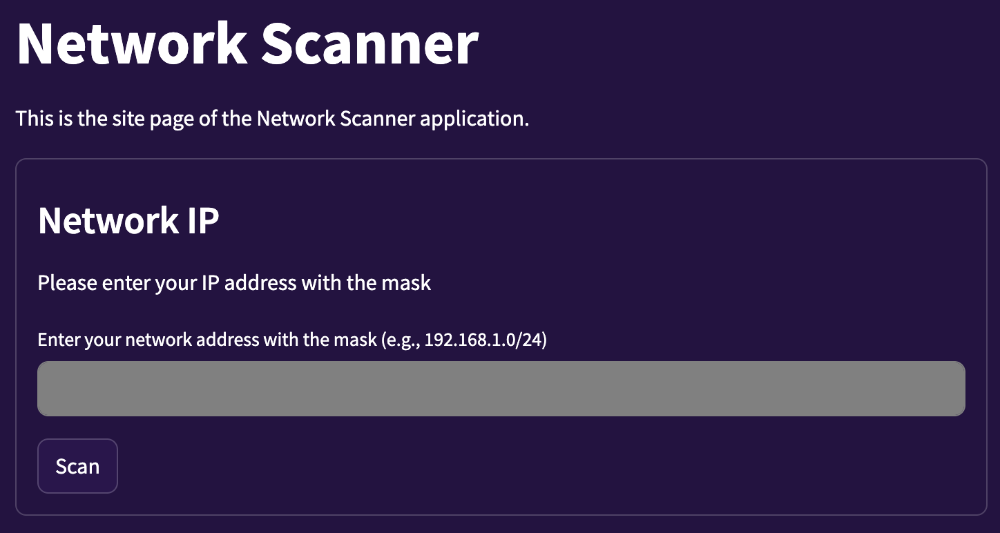
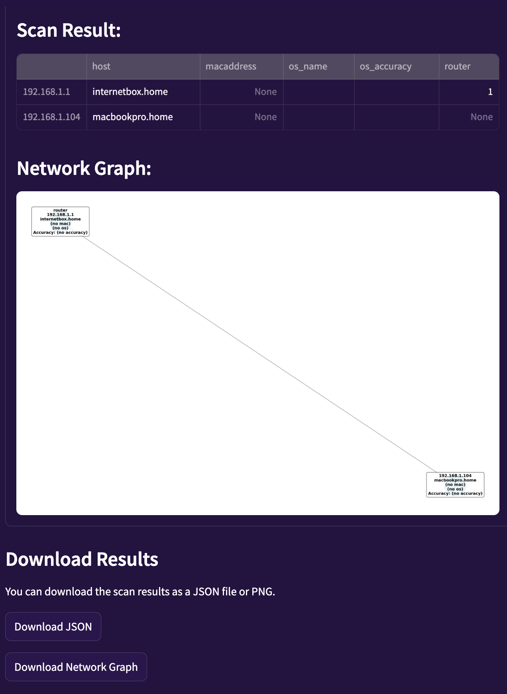

# Network scanner

Network scanner est un outil écrit en Python permettant d'explorer la topologie du réseau auquel l'utilisateur est connecté.

---

Auteurs : 
- Kevin Auberson : https://github.com/kevinAuberson
- Stefano Bianchet : https://github.com/StefBianchet
- Adrian Rogner : https://github.com/AdrianRogner
- Michael Strefeler : https://github.com/michaelstrefeler

---

## Prérequis

- [Python >= 3.12](https://www.python.org/downloads/release/python-31210/)
- [Poetry](https://python-poetry.org/docs/#installation)
- [Nmap](https://nmap.org/download.html)
- [Docker](https://docs.docker.com/engine/install/) (*optionnel*)

## Utilisation

### Scan du réseau local

Pour scanner votre réseau local il suffit d'aller à la racine du projet depuis votre terminal préféré et de lancer la commande suivante :
``` bash
    poetry install
``` 
puis :
``` bash
    poetry run streamlit run src/networkscanner/site.py
```

Ensuite il vous suffit d'ouvrir votre navigateur et d'aller à l'adresse suivante [http://localhost:8501](http://localhost:8501/), sur ce site il faut entrer l'adresse IP du réseau suivi du masque dans le formulaire.



Après avoir scanné le réseau le site affichera un tableau contenant toutes les hôtes ainsi qu'un graphique de la topologie réseau. Les données et le graphique sont téléchargeables.



### Scan du réseau de test sur Docker

Pour utiliser le scanner sur un réseau de test, vous pouvez utiliser Docker. Assurez-vous d'avoir Docker installé et exécutez les commandes suivantes depuis la racine du projet :

```bash
  docker compose up -d
```

Puis connectez-vous à l'interface web de Streamlit à l'adresse [http://localhost:8080](http://localhost:8080/) et procédez aux mêmes étapes qu'au scanne du réseau local.

### Utilisation de la CLI

Pour utiliser le scanner en ligne de commande, vous devez d'abord installer les dépendances du projet en exécutant la commande suivante depuis la racine du projet :
```bash
  poetry install
```
Ensuite, vous pouvez exécuter le scanner en ligne de commande avec la commande suivante :
```bash
  poetry run python -m networkscanner --ipaddress <your network address with CIDR mask>
```
Par exemple, pour scanner le réseau :
```bash
  poetry run python -m networkscanner --ipaddress 192.168.1.0/24
```

## Contribuer au projet

### Ajouter une fonctionnalité ou corriger un bug

Si vous souhaitez contribuer au projet, vous pouvez le faire en suivant ces étapes :

1. Fork le dépôt GitHub.
2. Créez une branche pour votre fonctionnalité ou correction de bug :
```bash
   git checkout -b feature/your-feature-name
```
3. Faites vos modifications et ajoutez-les :
```bash
    git add .
```
4. Commitez vos modifications en mettant un message de commit qui suit les conventions de nommage de https://www.conventionalcommits.org/
```bash
    git commit -m "Description de votre modification"
```
5. S'assurer que vos changements passent les tests sur guthub actions, si ce n'est pas le cas, corrigez les erreurs.

6. Poussez votre branche vers votre fork :
```bash
    git push origin feature/your-feature-name
```
7. Ouvrez une Pull Request sur le dépôt original en expliquant les modifications apportées.
8. Attendez que votre PR soit revue et éventuellement fusionnée.
9. Si votre PR est acceptée, vous pouvez supprimer votre branche locale et distante :
```bash
    git branch -d feature/your-feature-name
    git push origin --delete feature/your-feature-name
```

### Effectuer les tests en local

Pour exécuter les tests du projet, vous devez d'abord installer les dépendances de test en exécutant la commande suivante depuis la racine du projet :
```bash
  poetry install --with test
```

Suite à cela, vous pouvez exécuter les tests avec la commande suivante :
```bash
  poetry run pytest
```